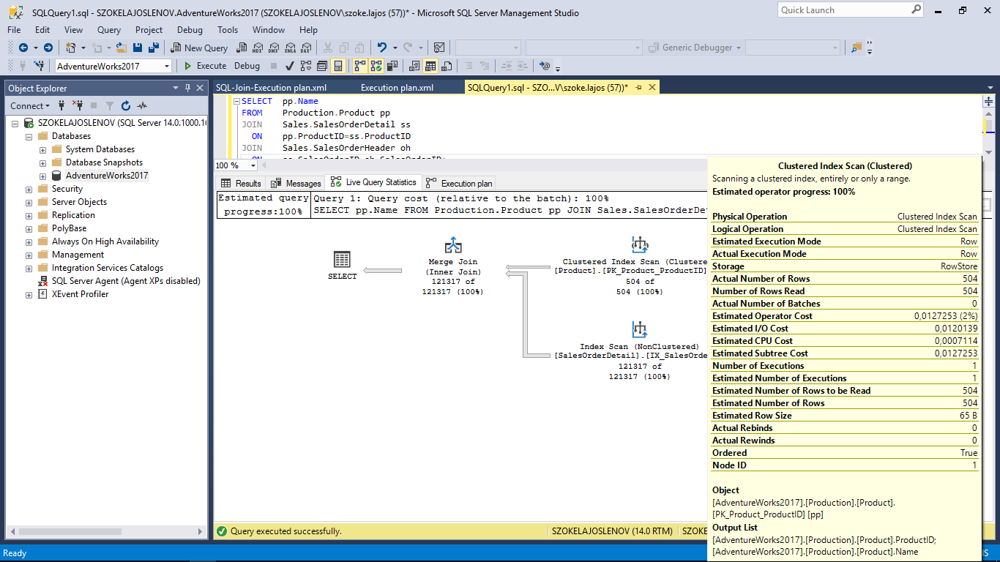

## Query Plan Samples
### Join tables
  1. Run Task1
  2. Have a look at the results of the execution plan, and we'll see we've got a "Clustered Index Scan" here, and this one is going to have a look at the "Product" table, and another "Index Scan" here, this one is having a sales with a data table.
  
```sql
-- Task1 (actually joining multiple tables)
SELECT  pp.Name
FROM    Production.Product pp
JOIN    Sales.SalesOrderDetail ss
  ON    pp.ProductID=ss.ProductID
JOIN    Sales.SalesOrderHeader oh
  ON    ss.SalesOrderID=oh.SalesOrderID;
```
  Have a look at the results of the execution plan, and we'll see we've got a "Clustered Index Scan" here, and this one is going to have a look at the "Product" table, and another "Index Scan" here, his one is having a "Sales" with a data table.
  So, there is no reference whatsoever to the ''Sales Order Header" table. The reason for that is the optimizer is efficient enough to realize that actually, it's impossible for there to be any information from "Sales Order Header". So, if is not possible that there is information from that table,it won't actually add that table to the plan.



```sql
SELECT * 
FROM    HumanResources.Employee 
WHERE   SickLeaveHours=50;

SELECT  CHECK_CLAUSE
FROM    INFORMATION_SCHEMA.CHECK_CONSTRAINTS
WHERE   CONSTRAINT_NAME = 'CK_Employee_SickLeaveHours';
____________________________________________________________
```

```sql
SELECT *
FROM sys.dm_exec_query_transformation_stats
ORDER BY name;

SELECT TOP 5 total_worker_time/execution_count AS [Avg CPU Time],  
Plan_handle, query_plan   
FROM sys.dm_exec_query_stats AS qs  
CROSS APPLY sys.dm_exec_query_plan(qs.plan_handle)  
ORDER BY total_worker_time/execution_count DESC;  
```

## Links
[Clustered and Nonclustered Indexes Described](https://docs.microsoft.com/en-us/sql/relational-databases/indexes/clustered-and-nonclustered-indexes-described?view=sql-server-2017)

[System Dynamic Management Views-Microsoft](https://docs.microsoft.com/en-us/sql/relational-databases/system-dynamic-management-views/system-dynamic-management-views?view=sql-server-2017)

[Execution Related Dynamic Management Views and Functions (Transact-SQL)](https://docs.microsoft.com/en-us/sql/relational-databases/system-dynamic-management-views/execution-related-dynamic-management-views-and-functions-transact-sql?view=sql-server-2017)

[sys.dm_exec_query_plan (Transact-SQL)](https://docs.microsoft.com/en-us/sql/relational-databases/system-dynamic-management-views/sys-dm-exec-query-plan-transact-sql?view=sql-server-2017#examples)
